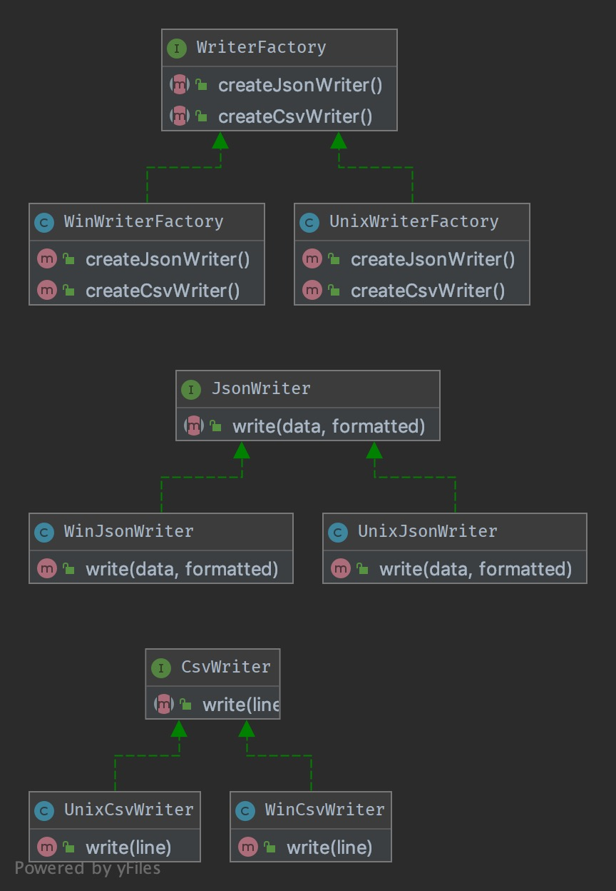
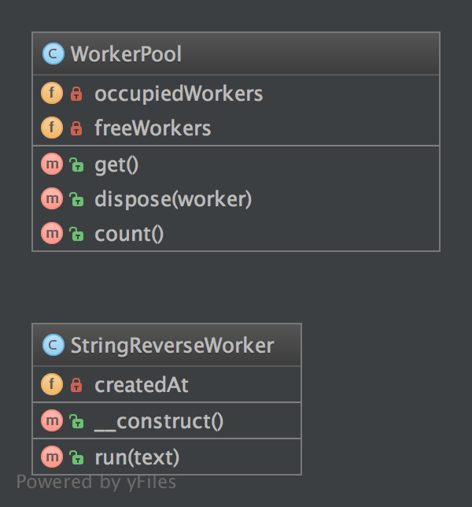

# 创建型设计模式

## 抽象工厂 abstractFactory


<p style="text-align:center;">图1</p>    

> 在不指定具体类的情况下创建一系列相关或依赖对象。通常，
> <span style="color:red;">创建的类都实现同一个接口。</span>抽象工厂的客户机并不关心这些对象是如何创建的，它只知道它们是如何组合在一起的。

[图1->抽象工厂代码](https://github.com/gaotiefeng/ttnote/tree/master/docs/language/php/app/Factory/)

## 生成器模式

>生成器的目的是将复杂对象的创建过程（流程）进行抽象，生成器表现为接口的形式。
在特定的情况下，比如如果生成器对将要创建的对象有足够多的了解，那么代表生成器的接口(interface)可以是一个抽象类(也就是说可以有一定的具体实现，就像众所周知的适配器模式)。
如果对象有复杂的继承树，理论上创建对象的生成器也同样具有复杂的继承树。
>
 
<p style="text-align:center;">图2</p>    

[图2->生成器代码](https://github.com/gaotiefeng/ttnote/tree/master/docs/language/php/app/Builder/)

## 工厂模式
- 创建你自己的方法。不要过分依赖于我给出的方法。要确定最适合你的做法！不过拜托要尽量打破常规。 ----康斯坦丁·斯坦尼斯拉夫斯基
- 这个模式是一个 “真正” 的设计模式，因为它遵循了依赖反转原则（Dependency Inversion Principle “D” 代表了真正的面向对象程序设计。
- 它意味着工厂方法类依赖于类的抽象，而不是具体将被创建的类，这是工厂方法模式与简单工厂模式和静态工厂模式最重要的区别


<p style="text-align:center;">图3</p>    

[图3->工厂代码](https://github.com/gaotiefeng/ttnote/tree/master/docs/language/php/app/Factory/Factory/)

###### 简单的列子

```php
<?php
// todo insterface and abstractFactory
 interface Transport{
     public function go();

 }
 class Bus implements Transport{
     public function go(){
         echo "bus每一站都要停";
     }
 }
 class Car implements Transport{
     public function go(){
         echo "car跑的飞快";
     }
 }
 class Bike implements Transport{
     public function go(){
         echo "bike比较慢";
     }
 }
 class transFactory{
     public static function factory($transport)
     {

         switch ($transport) {
             case 'bus':
                 return new Bus();
                 break;

             case 'car':
                 return new Car();
                 break;
             case 'bike':
                 return new Bike();
                 break;
         }
     }
 }
 $transport=transFactory::factory('car');
 $transport->go();
 ```

## 对象池设计模式 Purpose

>对象池设计模式 是创建型设计模式，它会对新创建的对象应用一系列的初始化操作，
让对象保持立即可使用的状态 - 一个存放对象的 “池子” - 而不是对对象进行一次性的的使用(创建并使用，完成之后立即销毁)。
对象池的使用者会对对象池发起请求，以期望获取一个对象，并使用获取到的对象进行一系列操作，当使用者对对象的使用完成之后，
使用者会将由对象池的对象创建工厂创建的对象返回给对象池，而不是用完之后销毁获取到的对象。
对象池在某些情况下会带来重要的性能提升，比如耗费资源的对象初始化操作，实例化类的代价很高，但每次实例化的数量较少的情况下。
对象池中将被创建的对象会在真正被使用时被提前创建，
避免在使用时让使用者浪费对象创建所需的大量时间(比如在对象某些操作需要访问网络资源的情况下)从池子中取得对象的时间是可预测的，
但新建一个实例所需的时间是不确定。
总之，对象池会为你节省宝贵的程序执行时间，
比如像数据库连接，socket连接，大量耗费资源的代表数字资源的对象，像字体或者位图。不过，在特定情况下，
简单的对象创建池(没有请求外部的资源，仅仅将自身保存在内存中)或许并不会提升效率和性能，这时候，就需要使用者酌情考虑了。


<p style="text-align:center;">图4</p>    

[图4->对象池设计模式](https://github.com/gaotiefeng/ttnote/tree/master/docs/language/php/app/Purpose/)

```php
<?php declare(strict_types=1);

namespace App\Purpose;

use DateTime;

class StringReversWorker
{
    ## php7.4
    ##private DateTime $createdAt;

    /** @var DateTime $createdAt*/
    private $createdAt;

    public function __construct()
    {
        $this->createdAt = new DateTime();
    }

    public function run(string $text)
    {
        return strrev($text);
    }
}

use Countable;

class WorkerPool implements Countable
{
    /**
     * @var StringReversWorker[]
     */
    private $occupiedWorkers = [];

    /**
     * @var StringReversWorker[]
     */
    private $freeWorkers = [];

    public function get(): StringReversWorker
    {
        if (count($this->freeWorkers) == 0) {
            $worker = new StringReversWorker();
        }else {
            $worker = array_pop($this->freeWorkers);
        }
        ##spl_object_hash — 返回指定对象的hash id
        $this->occupiedWorkers[spl_object_hash($worker)] = $worker;
        return $worker;
    }

    public function dispose(StringReversWorker $worker)
    {
        $key = spl_object_hash($worker);

        if (isset($this->occupiedWorkers[$key]))
        {
            unset($this->occupiedWorkers[$key]);
            $this->freeWorkers[$key] = $worker;
        }
    }

    public function count():int
    {
        return count($this->occupiedWorkers) + count($this->freeWorkers);
    }
}
```

## 单例模式
###### 单例模式已经被考虑列入到反模式中！请使用依赖注入获得更好的代码可测试性和可控性！ 
>单例模式解决的是如何在整个项目中创建唯一对象实例的问题
>使应用中只存在一个对象的实例，并且使这个单实例负责所有对该对象的调用。

[单列模式](https://github.com/gaotiefeng/ttnote/tree/master/docs/language/php/app/Design/Create/)

```php
<?php
class Singleton
{
    private static $uniqueInstance = null;

    public static function getInstance()
    {
        if (self::$uniqueInstance === null) {
            self::$uniqueInstance = new self;
        }

        return self::$uniqueInstance;
    }

    protected function __construct()
    {
    }

    private function __clone()
    {
    }
}
```

- 场景 数据库连接器 日志记录器 应用锁文件     

```php
class Single{
     public $hash;
     static protected $ins=null;
     final protected function __construct(){
         $this->hash=rand(1,9999);
     }

     static public function getInstance(){
         if (self::$ins instanceof self) {
             return self::$ins;
         }
         self::$ins=new self();
         return self::$ins;
     }
 }
 ```

## 静态工厂


## 原型设计模式（Prototype Design Pattern) clone
###### 通过创建一个原型对象，然后复制原型对象来避免通过标准的方式创建大量的对象产生的开销(new Foo())。
[原型设计模式](https://github.com/gaotiefeng/ttnote/tree/master/docs/language/php/app/Design/Create/)


```php
<?php

abstract class Iproto {
    protected $name;

    abstract function __clone();

    abstract function setName();
    abstract function getName();
}
// todo 多个创建
class A extends Iproto {
    
    protected $name;

    public function setName($name)
    {
        $this->name = $name;
    }
    
    public function getName()
    {
        return $this->name;
    }

    function __clone(){}
}

class Client {
    private $name;
    private $a;

    public function __construct()
    {
        $this->a = new a();
        $a = clone $this->a;
        $a->setName('this is clone');
        $this->name = $a->geName();
    }
}
```

# 结构性设计模式 （如下）

## 适配器模式（Adapter）(类和对象)
###### 能生存下来的物种，不是最强壮的，也不是最聪明的，而是能因应环境变化的物种 --查尔斯·达尔文
>定义一个接口(有几个方法，以及相应的参数)。然后，有几种不同的情况，就写几个类实现该接口。将完成相似功能的函数，统一成一致的方法。


## 桥接模式

## 组合模式

## 桥接模式

## 数据映射器

## 装饰器

## 依赖注入

## 外观模式

## 连贯模式

## Flyweight模式

## 代理模式

## 注册模式
>注册模式，解决全局共享和交换对象。已经创建好的对象，挂在到某个全局可以使用的数组上，在需要使用的时候，直接从该数组上获取即可。将对象注册到全局的树上。任何地方直接去访问。


