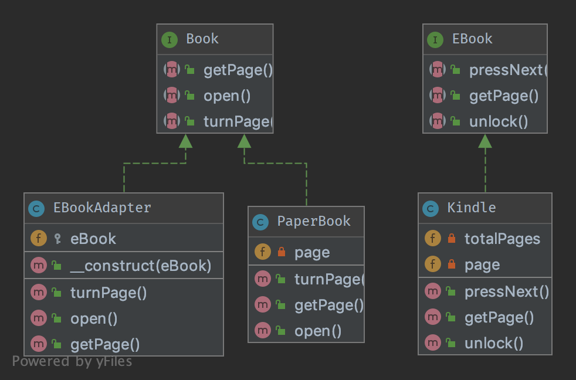
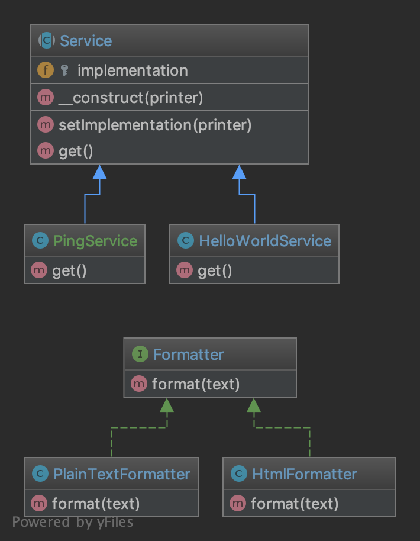
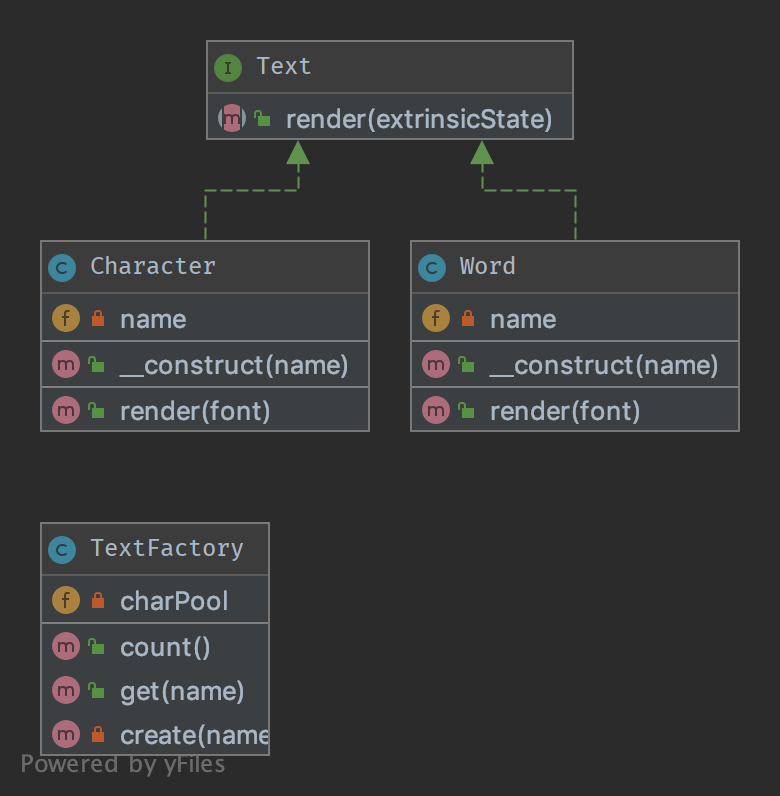
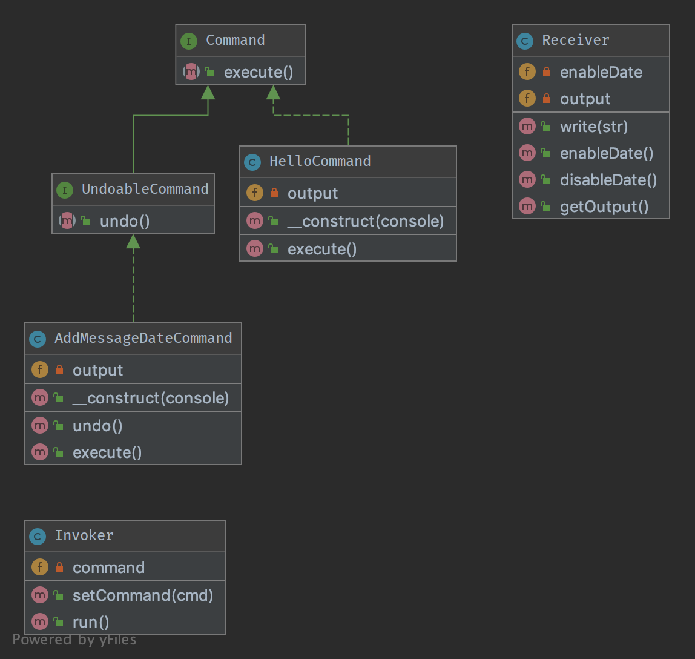
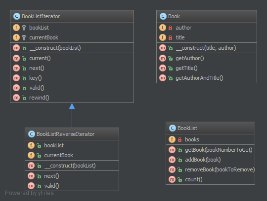
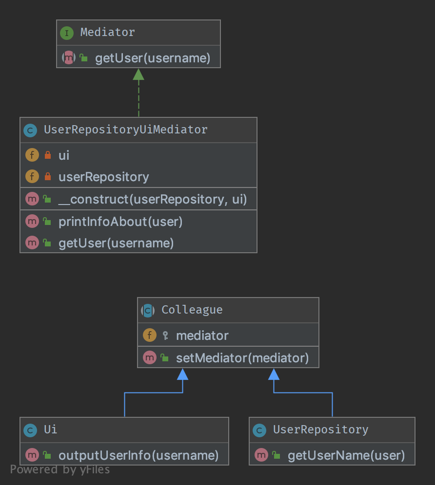

# php-设计模式
>依赖反转原则是一种特定解耦形式，它使得高层次的模块不依赖低层次的模块的实现细节，两者都应该依赖于抽象接口，
>而且抽象接口不应该依赖于具体实现，具体实现应该依赖于抽象的接口。
 # 1.创建型设计模式

## 1.1抽象工厂 abstractFactory


<p style="text-align:center;">抽象工厂图</p>    

> 在不指定具体类的情况下创建一系列相关或依赖对象。通常，
> <span style="color:red;">创建的类都实现同一个接口。</span>抽象工厂的客户机并不关心这些对象是如何创建的，它只知道它们是如何组合在一起的。

[代码->抽象工厂代码](https://github.com/gaotiefeng/ttnote/tree/master/docs/language/php/app/Factory/)

## 1.2生成器模式

>生成器的目的是将复杂对象的创建过程（流程）进行抽象，生成器表现为接口的形式。
在特定的情况下，比如如果生成器对将要创建的对象有足够多的了解，那么代表生成器的接口(interface)可以是一个抽象类(也就是说可以有一定的具体实现，就像众所周知的适配器模式)。
如果对象有复杂的继承树，理论上创建对象的生成器也同样具有复杂的继承树。
>
 
<p style="text-align:center;">生成器图</p>    

[代码->生成器代码](https://github.com/gaotiefeng/ttnote/tree/master/docs/language/php/app/Design/Create/Builder/)

## 1.3工厂模式
- 创建你自己的方法。不要过分依赖于我给出的方法。要确定最适合你的做法！不过拜托要尽量打破常规。 ----康斯坦丁·斯坦尼斯拉夫斯基
- 这个模式是一个 “真正” 的设计模式，因为它遵循了依赖反转原则（Dependency Inversion Principle “D” 代表了真正的面向对象程序设计。
- 它意味着工厂方法类依赖于类的抽象，而不是具体将被创建的类，这是工厂方法模式与简单工厂模式和静态工厂模式最重要的区别


<p style="text-align:center;">工厂模式图</p>    

[代码->工厂代码](https://github.com/gaotiefeng/ttnote/tree/master/docs/language/php/app/Factory/Factory/)

###### 简单的列子

```php
<?php
// todo insterface and abstractFactory
 interface Transport{
     public function go();

 }
 class Bus implements Transport{
     public function go(){
         echo "bus每一站都要停";
     }
 }
 class Car implements Transport{
     public function go(){
         echo "car跑的飞快";
     }
 }
 class Bike implements Transport{
     public function go(){
         echo "bike比较慢";
     }
 }
 class transFactory{
     public static function factory($transport)
     {

         switch ($transport) {
             case 'bus':
                 return new Bus();
                 break;

             case 'car':
                 return new Car();
                 break;
             case 'bike':
                 return new Bike();
                 break;
         }
     }
 }
 $transport=transFactory::factory('car');
 $transport->go();
 ```

## 1.4对象池设计模式 Purpose

>对象池设计模式 是创建型设计模式，它会对新创建的对象应用一系列的初始化操作，
让对象保持立即可使用的状态 - 一个存放对象的 “池子” - 而不是对对象进行一次性的的使用(创建并使用，完成之后立即销毁)。
对象池的使用者会对对象池发起请求，以期望获取一个对象，并使用获取到的对象进行一系列操作，当使用者对对象的使用完成之后，
使用者会将由对象池的对象创建工厂创建的对象返回给对象池，而不是用完之后销毁获取到的对象。
对象池在某些情况下会带来重要的性能提升，比如耗费资源的对象初始化操作，实例化类的代价很高，但每次实例化的数量较少的情况下。
对象池中将被创建的对象会在真正被使用时被提前创建，
避免在使用时让使用者浪费对象创建所需的大量时间(比如在对象某些操作需要访问网络资源的情况下)从池子中取得对象的时间是可预测的，
但新建一个实例所需的时间是不确定。
总之，对象池会为你节省宝贵的程序执行时间，
比如像数据库连接，socket连接，大量耗费资源的代表数字资源的对象，像字体或者位图。不过，在特定情况下，
简单的对象创建池(没有请求外部的资源，仅仅将自身保存在内存中)或许并不会提升效率和性能，这时候，就需要使用者酌情考虑了。


<p style="text-align:center;">对象池设计模式图</p>    

[代码->对象池设计模式](https://github.com/gaotiefeng/ttnote/tree/master/docs/language/php/app/Design/Create/Purpose/)

```php
<?php declare(strict_types=1);

namespace App\Purpose;

use DateTime;

class StringReversWorker
{
    ## php7.4
    ##private DateTime $createdAt;

    /** @var DateTime $createdAt*/
    private $createdAt;

    public function __construct()
    {
        $this->createdAt = new DateTime();
    }

    public function run(string $text)
    {
        return strrev($text);
    }
}

use Countable;

class WorkerPool implements Countable
{
    /**
     * @var StringReversWorker[]
     */
    private $occupiedWorkers = [];

    /**
     * @var StringReversWorker[]
     */
    private $freeWorkers = [];

    public function get(): StringReversWorker
    {
        if (count($this->freeWorkers) == 0) {
            $worker = new StringReversWorker();
        }else {
            $worker = array_pop($this->freeWorkers);
        }
        ##spl_object_hash — 返回指定对象的hash id
        $this->occupiedWorkers[spl_object_hash($worker)] = $worker;
        return $worker;
    }

    public function dispose(StringReversWorker $worker)
    {
        $key = spl_object_hash($worker);

        if (isset($this->occupiedWorkers[$key]))
        {
            unset($this->occupiedWorkers[$key]);
            $this->freeWorkers[$key] = $worker;
        }
    }

    public function count():int
    {
        return count($this->occupiedWorkers) + count($this->freeWorkers);
    }
}
```

## 1.5单例模式
###### 单例模式已经被考虑列入到反模式中！请使用依赖注入获得更好的代码可测试性和可控性！ 
>单例模式解决的是如何在整个项目中创建唯一对象实例的问题
>使应用中只存在一个对象的实例，并且使这个单实例负责所有对该对象的调用。

[代码-单列模式](https://github.com/gaotiefeng/ttnote/tree/master/docs/language/php/app/Design/Create/Instance/)

```php
<?php
class Singleton
{
    private static $uniqueInstance = null;

    public static function getInstance()
    {
        if (self::$uniqueInstance === null) {
            self::$uniqueInstance = new self;
        }

        return self::$uniqueInstance;
    }

    protected function __construct()
    {
    }

    private function __clone()
    {
    }
}
```

- 场景 数据库连接器 日志记录器 应用锁文件     

```php
class Single{
     public $hash;
     static protected $ins=null;
     final protected function __construct(){
         $this->hash=rand(1,9999);
     }

     static public function getInstance(){
         if (self::$ins instanceof self) {
             return self::$ins;
         }
         self::$ins=new self();
         return self::$ins;
     }
 }
 ```

## 1.6静态工厂
>和抽象工厂类似，静态工厂模式用来创建一系列互相关联或依赖的对象，
>和抽象工厂类似，静态工厂模式用来创建一系列互相关联或依赖的对象，
和抽象工厂模式不同的是静态工厂模式只用一个静态方法就解决了所有类型的对象创建，
通常被命名为``工厂`` 或者 构建器


<p style="text-align:center;">静态工厂模式图</p>   

[代码-静态工厂模式](https://github.com/gaotiefeng/ttnote/tree/master/docs/language/php/app/Design/Create/StaticFactory/)


## 1.7原型设计模式（Prototype Design Pattern) clone
###### 通过创建一个原型对象，然后复制原型对象来避免通过标准的方式创建大量的对象产生的开销(new Foo())。


[代码-原型设计模式](https://github.com/gaotiefeng/ttnote/tree/master/docs/language/php/app/Design/Create/Prototype/)


```php
<?php

abstract class Iproto {
    protected $name;

    abstract function __clone();

    abstract function setName();
    abstract function getName();
}
// todo 多个创建
class A extends Iproto {
    
    protected $name;

    public function setName($name)
    {
        $this->name = $name;
    }
    
    public function getName()
    {
        return $this->name;
    }

    function __clone(){}
}

class Client {
    private $name;
    private $a;

    public function __construct()
    {
        $this->a = new a();
        $a = clone $this->a;
        $a->setName('this is clone');
        $this->name = $a->geName();
    }
}
```

# 2.结构性设计模式 （如下）

## 2.1适配器模式（Adapter）(类和对象)
###### 能生存下来的物种，不是最强壮的，也不是最聪明的，而是能因应环境变化的物种 --查尔斯·达尔文
###### 目的 将某个类的接口转换成与另一个接口兼容。适配器通过将原始接口进行转换，
###### 给用户提供一个兼容接口，使得原来因为接口不同而无法一起使用的类可以得到兼容。

>定义一个接口(有几个方法，以及相应的参数)。然后，有几种不同的情况，就写几个类实现该接口。将完成相似功能的函数，统一成一致的方法。


<p style="text-align:center;">适配器图</p>   

###### 场景-数据库客户端库适配器-使用不同的webservices，通过适配器来标准化输出数据，从而保证不同webservice输出的数据是一致的
- 代码
[适配器模式](https://github.com/gaotiefeng/ttnote/tree/master/docs/language/php/app/Design/Struct/Adapter)


## 2.2桥接模式

###### 目的-解耦一个对象的实现与抽象，这样两者可以独立地变化。


<p style="text-align:center;">桥接模式图</p>   

[代码-桥接模式](https://github.com/gaotiefeng/ttnote/tree/master/docs/language/php/app/Design/Struct/Bridging)


## 2.3组合模式

###### 以单个对象的方式来对待一组对象
       


<p style="text-align:center;">组合模式图</p>   

[代码-组合模式](https://github.com/gaotiefeng/ttnote/tree/master/docs/language/php/app/Design/Struct/Combination)

## 2.4数据映射器

###### 目的
>数据映射器是一个数据访问层，用于将数据在持久性数据存储（通常是一个关系数据库）和内存中的数据表示（领域层）之间进行相互转换。其目的是为了将数据的内存表示、持久存储、数据访问进行分离。该层由一个或者多个映射器组成（或者数据访问对象），并且进行数据的转换。映射器的实现在范围上有所不同。通用映射器将处理许多不同领域的实体类型，而专用映射器将处理一个或几个。
此模式的主要特点是，与Active Record不同，其数据模式遵循单一职责原则(Single Responsibility Principle)。

###### 场景 ~~数据库对象关系映射器（ORM）~~


<p style="text-align:center;">数据映射器图</p>   

[代码-数据映射器](https://github.com/gaotiefeng/ttnote/tree/master/docs/language/php/app/Design/Struct/Mapper)

## 2.5装饰器
###### 目的-动态地为类的实例添加功能
###### 例子-Web Service层：REST服务的JSON与XML装饰器（当然，在此只能使用其中的一种)

<p style="text-align:center;">装饰器图</p>   

[代码-装饰器模式](https://github.com/gaotiefeng/ttnote/tree/master/docs/language/php/app/Design/Struct/Decorator)

## 2.6依赖注入-DI
###### 目的-实现了松耦合的软件架构，可得到更好的测试，管理和扩展的代码
###### 例子
###### 1.Doctrine2 ORM 使用了依赖注入，它通过配置注入了 Connection 对象。为了达到方便测试的目的，可以很容易的通过配置创建一个mock的``Connection`` 对象。
###### 2.框架中容器，通过容器依赖注入到controller /注解注入 


<p style="text-align:center;">依赖注入</p>   

[代码-依赖注入模式](https://github.com/gaotiefeng/ttnote/tree/master/docs/language/php/app/Design/Struct/Di/)

###### 将配置注入到Connection 
```php
class DatabaseConfiguration
{
    protected $host;

    protected $port;

    protected $username;

    protected $password;

    public function __construct(string $host,int $port,string $username,string $password)
    {
        $this->host = $host;
        $this->port = $port;
        $this->username = $username;
        $this->password = $password;
    }

    /**
     * @return string
     */
    public function getHost(): string
    {
        return $this->host;
    }

    /**
     * @return int
     */
    public function getPort(): int
    {
        return $this->port;
    }

    /**
     * @return string
     */
    public function getUsername(): string
    {
        return $this->username;
    }

    /**
     * @return string
     */
    public function getPassword(): string
    {
        return $this->password;
    }
}

class DatabaseConnection
{
    /** @var DatabaseConfiguration $configuration */
    private $configuration;

    public function __construct(DatabaseConfiguration $config)
    {
        $this->configuration = $config;
    }

    public function getConfig() :string
    {
        return sprintf(
            '%s:%s@%s:%d',
            $this->configuration->getUsername(),
            $this->configuration->getPassword(),
            $this->configuration->getHost(),
            $this->configuration->getPort()
        );
    }
}
```

## 2.7外观模式
###### 　外观模式(Facade Pattern)：外部与一个子系统的通信必须通过一个统一的外观对象进行，
###### 　为子系统中的一组接口提供一个一致的界面，外观模式定义了一个高层接口，这个接口使得这一子系统更加容易使用。
###### 　外观模式又称为门面模式，它是一种对象结构型模式。
###### Facade通过嵌入多个（当然，有时只有一个）接口来解耦访客与子系统，当然也降低复杂度。
- 为一个复杂子系统提供简单的接口
- Facade 不会禁止你访问子系统
- 你可以（应该）为一个子系统提供多个 Facade
- 减少客户端和子系统的耦合

>因此一个好的 Facade 里面不会有 new 。如果每个方法里都要构造多个对象，那么它就不是 Facade，而是生成器或者[抽象|静态|简单] 工厂 [方法]。
优秀的 Facade 不会有 new，并且构造函数参数是接口类型的。如果你需要创建一个新实例，则在参数中传入一个工厂对象。


<p style="text-align:center;">依赖注入</p>   

[代码-外观模式](https://github.com/gaotiefeng/ttnote/tree/master/docs/language/php/app/Design/Struct/Facade/)

## 2.8连贯模式
###### 目的-用来编写易于阅读的代码
###### 场景
- 框架中的 QueryBuilder


<p style="text-align:center;">连贯模式图</p>   

[代码-连贯模式](https://github.com/gaotiefeng/ttnote/tree/master/docs/language/php/app/Design/Struct/Facade/)

```php
class Sql
{
    protected $fields = [];
    protected $from = [];
    protected $where = [];

    public function select(array $fields) :Sql
    {
        $this->fields = $fields;
        return $this;
    }

    public function where(string $where) :Sql
    {
        $this->where[] = $where;
        return $this;
    }

    public function from(string $table, string $alias) :Sql
    {
        $this->from[] = $table . ' AS ' . $alias;
        return $this;
    }

    public function __toString():string
    {
        return sprintf(
            'SELECT %s FROM %s WHERE %s',
            join(', ', $this->fields),
            join(', ', $this->from),
            join(' AND ', $this->where)
        );
    }
}
```

## 2.9Flyweight模式（亨元模式）
###### 目的-为了最大限度地减少内存使用，Flyweight尽可能地与相似的对象共享内存。当使用了状态差别不大的大量对象时，
###### 就需要它。通常的做法是在外部数据结构中保持状态，并在需要时将其传递给flyweight对象。
>享元模式的定义为：采用一个共享来避免大量拥有相同内容对象的开销。这种开销中最常见、直观的就是内存的损耗。享元模式以共享的方式高效的支持大量的细粒度对象。


<p style="text-align:center;">Flyweight模式</p>   

[代码-Flyweight模式](https://github.com/gaotiefeng/ttnote/tree/master/docs/language/php/app/Design/Struct/Flyweight/)
>TextFactory 来共享Character，word类


```php
use Countable;

class TextFactory implements Countable
{
    /**
     * @var Text[]
     */
    private $charPool = [];

    public function get(string $name) : Text
    {
        if (!isset($this->charPool[$name])) {
            $this->charPool[$name] = $this->create($name);
        }

        return $this->charPool[$name];
    }

    public function create(string $name)
    {
        if (strlen($name) == 1) {
            return new Character($name);
        }else{
            return new Word($name);
        }
    }

    public function count() : int
    {
        return count($this->charPool);
    }
}
```

## 2.10代理模式
###### 目的-为昂贵或者无法复制的资源提供接口。
###### 场景-Cache代理-防火墙（Firewall）

<p style="text-align:center;">代理模式</p>   

[代码-代理模式](https://github.com/gaotiefeng/ttnote/tree/master/docs/language/php/app/Design/Struct/Proxy/)

## 2.11注册模式
>注册模式，解决全局共享和交换对象。已经创建好的对象，挂在到某个全局可以使用的数组上，在需要使用的时候，直接从该数组上获取即可。将对象注册到全局的树上。任何地方直接去访问。
>为了实现在整个应用程序中经常使用的对象的中央存储，通常使用只有静态方法的抽象类（或使用Singleton模式）来实现。请记住，
>这会引入全局状态，这在任何时候都应该避免！而是使用依赖注入来实现它！
>

```php
use InvalidArgumentException;

abstract class Registry
{
    const LOGGER = 'logger';

    private static $services = [];
    private static $allowedKeys = [ self::LOGGER ];

    public static function set(string $key,Service $value)
    {
        if (!in_array($key,self::$allowedKeys)) {
            throw new InvalidArgumentException('Invalid key given');
        }

        self::$services[$key] = $value;
    }

    public static function get(string $key)
    {
        if (!in_array($key,self::$allowedKeys) || !isset(self::$services[$key])) {
            throw new InvalidArgumentException('Invalid key given');
        }

        return self::$services[$key];
    }
}
```


<p style="text-align:center;">注册模式</p>   

[代码-注册模式](https://github.com/gaotiefeng/ttnote/tree/master/docs/language/php/app/Design/Struct/Registry/)

# 3.行为型设计模式Behavioral

## 3.1责任链(Chain Of Responsibilities)
###### 目的-建立对象链以按顺序处理调用。如果一个对象不能处理一个调用，它将调用委托给链中的下一个对象，以此类推。
`composer require psr/http-message`
###### 场景-审批流程-组长未审批-管理员审批


<p style="text-align:center;">责任链模式</p>   

[代码-责任链模式](https://github.com/gaotiefeng/ttnote/tree/master/docs/language/php/app/Design/Behavioral/Chain/)

```php
namespace App\Design\Behavioral\Chain;

use Psr\Http\Message\RequestInterface;

abstract class Handler
{
    /** @var Handler $handler */
    protected $successor;

    public function __construct(Handler $handler = null)
    {
        $this->successor = $handler;
    }

    public function handler(RequestInterface $request): ?string
    {
        $processing = $this->processing($request);

        if ($processing === null && $this->successor !== null) {
            $processing = $this->successor->processing($request);
        }

        return $processing;
    }

    abstract protected function processing(RequestInterface $request): ?string ;
}

class HttpInMemoryCacheHandler extends Handler
{
    /** @var array $data */
    private  $data;

    public function __construct(array $data, ?Handler $successor = null)
    {
        parent::__construct($successor);

        $this->data = $data;
    }

    protected function processing(RequestInterface $request): ?string
    {
        $key = sprintf(
            '%s?%s',
            $request->getUri()->getPath(),
            $request->getUri()->getQuery()
        );

        if ($request->getMethod() == 'GET' && isset($this->data[$key])) {
            return $this->data[$key];
        }

        return null;
    }
}

```

## 3.2命令模式(Command)

>To encapsulate invocation and decoupling.
We have an Invoker and a Receiver. This pattern uses a “Command” to delegate the method call against the Receiver and presents the same method “execute”. Therefore, the Invoker just knows to call “execute” to process the Command of the client. The Receiver is decoupled from the Invoker.
The second aspect of this pattern is the undo(), which undoes the method execute(). Command can also be aggregated to combine more complex commands with minimum copy-paste and relying on composition over inheritance.
封装调用和分离。
我们有一个调用器和一个接收器。此模式使用一个“命令”将方法调用委托给接收方，并呈现相同的方法“execute”。因此，调用程序只知道调用“execute”来处理客户机的命令。接收器与调用程序分离。
此模式的第二个方面是undo（），它撤消execute（）方法。还可以聚合命令，以将更复杂的命令与最少的复制粘贴和依赖组合而非继承结合起来。
- 命令模式的四种角色：
1. 接收者（Receiver）负责执行与请求相关的操作
2. 命令接口（Command）封装execute()、undo()等方法
3. 具体命令（HelloCommand）实现命令接口中的方法
4. 请求者（Invoker）包含Command接口变量


<p style="text-align:center;">责任链模式</p>   

[代码-3.2命令模式](https://github.com/gaotiefeng/ttnote/tree/master/docs/language/php/app/Design/Behavioral/Command/)

## 3.3迭代器模式(Iterator)
###### 迭代器（Iterator）模式，又叫做游标（Cursor）模式。
###### `GOF给出的定义为：提供一种方法访问一个容器（container）对象中各个元素，而又不需暴露该对象的内部细节。`
###### 一行一行地处理一个文件，只需遍历一个文件的所有行（这些行有一个对象表示法）（当然这也是一个对象）

<p style="text-align:center;">责任链模式</p>   

[代码-迭代器模式](https://github.com/gaotiefeng/ttnote/tree/master/docs/language/php/app/Design/Behavioral/Command/)

```php
namespace App\Design\Behavioral\Iterator;


class Book
{
    private $author;
    private $title;

    public function __construct(string $title, string $author)
    {
        $this->author = $author;
        $this->title = $title;
    }

    public function getAuthor():string
    {
        return $this->author;
    }

    /**
     * @return string
     */
    public function getTitle(): string
    {
        return $this->title;
    }

    public function getAuthorAndTitle() : string
    {
        return $this->getTitle().' by '.$this->getAuthor();
    }
}

use Countable;
use Iterator;

class BookList implements Countable, Iterator
{
    private $books = [];

    private $currentIndex = 0;

    public function addBook(Book $book)
    {
        $this->books[] = $book;
    }

    public function removeBook(Book $bookToRemove)
    {
        foreach ($this->books as $key => $book) {
            if ($book->getAuthorAndTitle() === $bookToRemove->getAuthorAndTitle()) {
                unset($this->books[$key]);
            }
        }

        $this->books = array_values($this->books);
    }

    public function count(): int
    {
        return count($this->books);
    }

    public function current(): Book
    {
        return $this->books[$this->currentIndex];
    }

    public function key(): int
    {
        return $this->currentIndex;
    }

    public function next()
    {
        $this->currentIndex++;
    }

    public function rewind()
    {
        $this->currentIndex = 0;
    }

    public function valid(): bool
    {
        return isset($this->books[$this->currentIndex]);
    }
}
```

## 3.4中介者模式(Mediator)
###### Purpose
>This pattern provides an easy way to decouple many components working together.
> It is a good alternative to Observer IF you have a “central intelligence”, 
>like a controller (but not in the sense of the MVC).
> All components (called Colleague) are only coupled to the Mediator interface and it is a good thing because in OOP,
> one good friend is better than many. This is the key-feature of this pattern.

###### 设计场景：
`我们有一个CD类和一个MP3类，两个类的结构相似。
我们需要在CD类更新的时候，同步更新MP3类。
传统的做法就是在CD类中实例化MP3类，然后去更新，但是这么做的话，代码就会很难维护，如果新增一个同样的MP4类，那么就没法处理了。
中介者模式很好的处理了这种情况，通过中介者类，CD类中只要调用中介者这个类，就能同步更新这些数据。`

###### UML

<p style="text-align:center;">责任链模式</p>   

[代码-Mediator模式](https://github.com/gaotiefeng/ttnote/tree/master/docs/language/php/app/Design/Behavioral/Mediator/)


## 3.5备忘录模式(Memento)

## 3.6空对象模式(Null Object)

## 3.7观察者模式(Observer)

## 3.8规格模式(Specification)

## 3.9状态模式(State)

## 3.10策略模式(Strategy)

## 3.11模版方法模式(Template Method)

## 3.12访问者模式(Visitor)